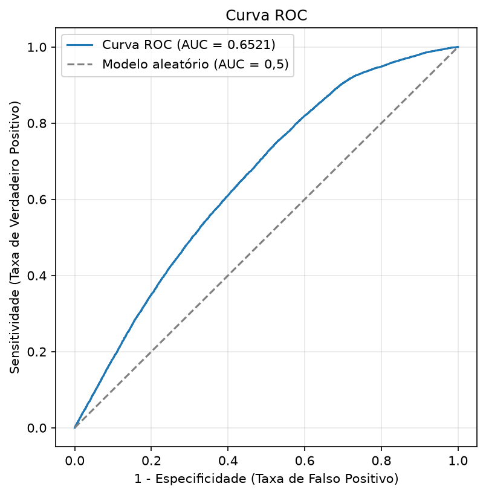
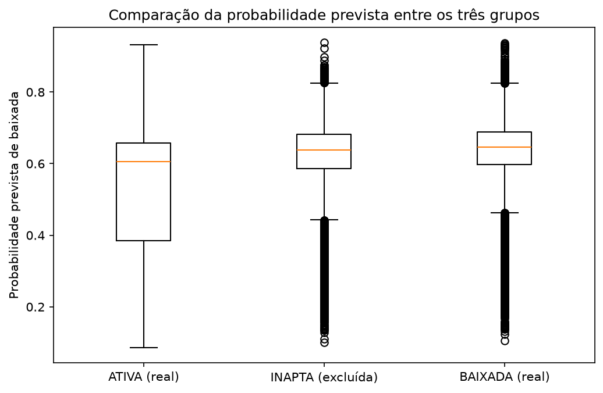

# Regressão Logística - Risco de Encerramento no Varejo


## 📖 Etapas do Projeto

### 1. Coleta dos Dados

- **Fonte:** [Dados Abertos de CNPJ](https://dados.gov.br/dados/conjuntos-dados/cadastro-nacional-da-pessoa-juridica---cnpj) — Receita Federal
  - Arquivos: Estabelecimentos, Empresas, Simples/MEI, Motivos e Naturezas (tabelas oficiais de referência código → descrição)
  - Extração de referência: 08/08/2026
  - Coorte: estabelecimentos com CNAE principal na divisão 47 (Comércio Varejista), abertos entre 2017 e 2019 → 1.911.883 estabelecimentos
  - Amostra estratificada para modelagem: 60.000 (estratificada por risco, justificada por EPV — Peduzzi et al. 1996)

### 2. Metodologia

- Definição do alvo em 4 buckets, cruzando `situacao_cadastral` + `motivo_situacao_cadastral` com a tabela oficial de Motivos (ATIVA / BAIXADA / INAPTA / RUÍDO), em vez de assumir a classificação
- Detecção de vazamento de dado por cruzamento com tabelas oficiais: artefato EIRELI (natureza jurídica extinta pela Lei 14.195/2021, causando 100% de taxa de fracasso artificial na amostra) e vazamento por construção em `optante_simples`/`optante_mei` (opção cancelada automaticamente na baixa) — ambos removidos dos preditores
- Agrupamento de categorias raras: `natureza_juridica` → `natureza_juridica_agrupada`; `uf` → `regiao` (5 regiões IBGE); `cnae_fiscal_principal` → `grupo_cnae` (9 grupos oficiais)
- Dummização manual (`pd.get_dummies(drop_first=True)`, regra n-1), categoria de referência fixada como a mais frequente de cada preditor
- Estimação inicial com 20 preditores (`sm.Logit.from_formula`)
- **Stepwise manual** — backward elimination por teste de Wald (`statsmodels` puro), implementado depois que o pacote `statstests.process.stepwise` entrou em loop infinito neste ambiente
- **Diagnóstico** — matriz de confusão, sensitividade/especificidade por cutoff, curva ROC/AUC/GINI
- **Análise de robustez** sobre o bucket INAPTA (situação cadastral ambígua, excluído do treino) — extensão metodológica própria, não coberta no material do curso

### 3. Resultado do Modelo Final

| Modelo | Descrição | Pseudo R² | AUC | GINI |
|---|---|---|---|---|
| `modelo_completo` | 20 preditores, antes do Stepwise | 0,0625 | — | — |
| `modelo_step_logit` | **Modelo final** — Stepwise manual, 18 preditores | **0,0624** | **0,6521** | **0,3042** |
| `modelo_step_robustez` | Refit com bucket INAPTA relabelado como baixada (teste de robustez) | 0,0535 | 0,6415 | 0,2829 |

*AUC/GINI do modelo completo não foram calculados separadamente — o diagnóstico ROC foi aplicado só ao modelo final. Se quiser preencher essa célula, é só rodar o mesmo `.predict()` + `roc_auc_score` sobre o `modelo_completo` no notebook 05.*

O modelo final manteve 18 das 20 variáveis originais (todas significativas a 5%), com AUC de 0,6521 e Pseudo R² de 0,0624 — praticamente igual ao modelo completo, confirmando que as duas variáveis removidas (`regiao_Norte`, `regiao_Sul`) tinham poder explicativo desprezível. O poder de discriminação é moderado — esperado para um modelo baseado só em dado cadastral público, sem histórico financeiro ou comportamental (bureaus de crédito completos chegam a AUC de 0,75 a 0,85+).

<p align="center">
  
</p>

**Principais achados:**

- `identificador_matriz_filial` (ser filial) tem o maior efeito isolado de risco entre os preditores (coeficiente +1,17 em relação a matriz)
- `capital_social_log` tem coeficiente negativo — mais capital social, menos risco, como esperado
- No cutoff padrão de 0,5, o modelo classifica baixada em excesso (especificidade de apenas 0,30); o ponto de equilíbrio entre sensitividade e especificidade fica em cutoff ≈ 0,62-0,63

**Limitações:** modelo restrito a dado cadastral público — sem histórico financeiro ou comportamental, o que limita o teto de discriminação frente a um bureau de crédito completo; `idade_empresa_anos` foi calculada em relação a uma data fixa de referência para toda a coorte, então seu coeficiente positivo pode refletir em parte um efeito de janela de exposição, não necessariamente maior fragilidade real de empresas mais antigas.

---

## 🔍 Análise de Robustez (bucket INAPTA)

O bucket INAPTA (situação cadastral ambígua, 12.822 empresas) foi excluído do treino por não ser claramente "ativa" nem "baixada". Para checar se essa exclusão escondia viés, o grupo foi scorado com o modelo final (`.predict()`) e comparado aos grupos reais:

<p align="center">
  
</p>

| Grupo | Probabilidade prevista (mediana) |
|---|---|
| ATIVA (real) | 0,605 |
| INAPTA (excluída) | 0,638 |
| BAIXADA (real) | 0,646 |

INAPTA fica muito mais próxima de BAIXADA do que de ATIVA — confirma que excluí-la do treino foi a decisão correta. Refazendo o Stepwise do zero com INAPTA relabelada como alvo=1 (linha `modelo_step_robustez` na tabela acima), nenhum coeficiente trocou de sinal e a AUC caiu apenas 1,6% — o modelo não é frágil a essa escolha alternativa de rótulo.

---

## ⚙️ Como Rodar

```bash
pip install -r requirements.txt
jupyter notebook notebooks/01_exploracao_preditores.ipynb
```
Os notebooks devem ser executados em ordem (01 → 06); cada um consome os artefatos persistidos pelo anterior.

## 📁 Estrutura

    sl-varejo-log/
    ├── data/
    │   ├── raw/                                  # extrações brutas da Receita
    │   ├── dataset_modelagem_final.parquet
    │   ├── df_modelo_treino.parquet
    │   ├── probs_treino.parquet
    │   └── modelo_final_logit.pickle
    ├── notebooks/
    │   ├── 01_exploracao_preditores.ipynb
    │   ├── 02_exclusao_artefato_eireli.ipynb
    │   ├── 03_agrupamento_natureza_juridica.ipynb
    │   ├── 04_agrupamento_uf_cnae.ipynb
    │   ├── 05_estimacao_modelo.ipynb
    │   └── 06_analise_robustez_inapta.ipynb
    ├── outputs/
    │   ├── curva_roc.png
    │   ├── sensitividade_especificidade_cutoff.png
    │   └── robustez_boxplot_inapta.png
    ├── src/
    │   ├── pipeline_extracao.py
    │   ├── preparacao_amostra.py
    │   ├── cruzamento_empresas.py
    │   ├── cruzamento_simples.py
    │   ├── redefinir_alvo.py
    │   └── dataset_modelagem.py
    ├── requirements.txt
    └── README.md
